# Ultron - Telegram LLM Gateway System

> **A complete orchestration system that bridges Telegram messaging with local LLM processing and external API posting.**

---

## 📋 Table of Contents

- [Overview](#overview)
- [Architecture](#architecture)
- [System Components](#system-components)
- [Prerequisites](#prerequisites)
- [Installation](#installation)
- [Configuration](#configuration)
- [Usage](#usage)
- [API Reference](#api-reference)
- [Development Tools](#development-tools)
- [Troubleshooting](#troubleshooting)
- [File Structure](#file-structure)

---

## 🎯 Overview

**Ultron** is a three-tier system that enables seamless communication between Telegram users and a local Large Language Model (LLM), with automatic posting of generated content to external APIs.

### What It Does

1. **Receives** messages from Telegram via webhooks
2. **Forwards** prompts to your local laptop running Ollama
3. **Generates** AI responses using your chosen LLM model
4. **Posts** the generated content to an external API
5. **Confirms** success back to the Telegram user

### Use Cases

- Personal AI assistant accessible via Telegram
- Automated content generation and publishing
- Private LLM processing without cloud dependencies
- Integration testing for AI-powered workflows

---

## 🏗️ Architecture

```mermaid
graph TD
    A["👤 Telegram User"] -->|Sends Message| B["🌐 Server Gateway<br/>(FastAPI on Port 8001)"]
    B -->|Forwards Prompt via ngrok| C["💻 On-Device Service<br/>(FastAPI on Port 8000)"]
    C -->|Calls Ollama| D["🤖 Ollama LLM<br/>(Local Instance)"]
    D -->|Returns Generated Text| C
    C -->|Returns Response| B
    B -->|Posts Content| E["📡 External API<br/>(Port 8002)"]
    E -->|Confirms| B
    B -->|Sends Status| A

    style A fill:#e1f5ff
    style B fill:#fff4e1
    style C fill:#e8f5e9
    style D fill:#f3e5f5
    style E fill:#fce4ec
```



### Data Flow

```
Telegram Message → Server Gateway → ngrok Tunnel → On-Device Service → Ollama →
Generated Content → Server Gateway → External API → Confirmation → Telegram User
```

---

## 🧩 System Components

### 1. **Server Gateway** (`server/`)

**Role:** Central orchestrator and Telegram webhook handler

**Key Features:**

- Receives Telegram webhook POST requests
- Authenticates with shared secrets
- Coordinates between on-device LLM and external API
- Sends status updates back to Telegram

**Main Files:**

- [`main.py`](file:///e:/ultron/server/main.py) - FastAPI application with webhook endpoint
- [`laptop_client.py`](file:///e:/ultron/server/laptop_client.py) - HTTP client for on-device service
- [`poster.py`](file:///e:/ultron/server/poster.py) - External API posting logic
- [`telegram.py`](file:///e:/ultron/server/telegram.py) - Telegram Bot API integration
- [`config.py`](file:///e:/ultron/server/config.py) - Environment-based configuration
- [`models.py`](file:///e:/ultron/server/models.py) - Pydantic data models

---

### 2. **On-Device Service** (`ondevice/`)

**Role:** Local LLM processing unit with Ollama integration

**Key Features:**

- Exposes `/generate` endpoint for text generation
- Validates shared secret authentication
- Interfaces with local Ollama instance
- Supports long-running generation requests (no timeout)

**Main Files:**

- [`app.py`](file:///e:/ultron/ondevice/app.py) - FastAPI application with generation endpoint
- [`ollama_client.py`](file:///e:/ultron/ondevice/ollama_client.py) - Ollama API wrapper
- [`config.py`](file:///e:/ultron/ondevice/config.py) - Service configuration
- [`models.py`](file:///e:/ultron/ondevice/models.py) - Request/response models

---

### 3. **External API** (`external/`)

**Role:** Mock/sample API for testing content posting

**Key Features:**

- Simple Express.js server
- Bearer token authentication
- Logs received payloads
- Returns confirmation responses

**Main Files:**

- [`index.js`](file:///e:/ultron/external/index.js) - Express server with `/post` endpoint

---

### 4. **Development Orchestrator** (`dev_runner.py`)

**Role:** Automated service launcher and coordinator

**Key Features:**

- Starts all services in correct order
- Manages ngrok tunnel for on-device service
- Auto-updates server configuration with ngrok URL
- Health check monitoring
- Mock query triggering for testing
- Graceful shutdown handling

---

## 📦 Prerequisites

### Required Software

1. **Python 3.10+**

   ```bash
   python --version
   ```

2. **Node.js 16+** (for external API)

   ```bash
   node --version
   ```

3. **Ollama** (local LLM runtime)
   - Download from [ollama.ai](https://ollama.ai)
   - Install a model: `ollama pull llama3`

4. **ngrok** (for tunneling)
   - Download from [ngrok.com](https://ngrok.com)
   - Add to system PATH

5. **Telegram Bot**
   - Create a bot via [@BotFather](https://t.me/botfather)
   - Save the bot token

---

## 🚀 Installation

### Step 1: Clone/Navigate to Repository

```bash
cd e:\ultron
```

### Step 2: Install Server Dependencies

```bash
cd server
pip install -r requirements.txt
```

**Dependencies:**

- `fastapi` - Web framework
- `uvicorn` - ASGI server
- `httpx` - Async HTTP client
- `pydantic-settings` - Configuration management
- `python-dotenv` - Environment variable loading

### Step 3: Install On-Device Service Dependencies

```bash
cd ../ondevice
pip install -r requirements.txt
```

**Dependencies:**

- `fastapi` - Web framework
- `uvicorn` - ASGI server
- `ollama` - Ollama Python client
- `pydantic-settings` - Configuration management
- `python-dotenv` - Environment variable loading

### Step 4: Install External API Dependencies

```bash
cd ../external
npm install
```

**Dependencies:**

- `express` - Node.js web framework

---

## ⚙️ Configuration

### Server Configuration (`server/.env`)

Create a `.env` file in the `server/` directory:

```env
# Telegram Bot Configuration
TELEGRAM_BOT_TOKEN=your_telegram_bot_token_here
DEFAULT_CHAT_ID=your_telegram_chat_id_here

# On-Device Service (will be auto-updated by dev_runner.py)
LAPTOP_API_URL=https://your-ngrok-url.ngrok.io/generate
LAPTOP_SHARED_SECRET=your_secure_shared_secret

# External API Configuration
EXTERNAL_API_URL=http://localhost:8002/post
EXTERNAL_API_KEY=your_external_api_bearer_token
```

**Configuration Details:**

| Variable               | Description                          | Example                                 |
| ---------------------- | ------------------------------------ | --------------------------------------- |
| `TELEGRAM_BOT_TOKEN`   | Token from @BotFather                | `1234567890:ABCdefGHIjklMNOpqrsTUVwxyz` |
| `DEFAULT_CHAT_ID`      | Your Telegram chat ID (optional)     | `123456789`                             |
| `LAPTOP_API_URL`       | On-device service URL (auto-updated) | `https://abc123.ngrok.io/generate`      |
| `LAPTOP_SHARED_SECRET` | Authentication secret                | `my-super-secret-key-2024`              |
| `EXTERNAL_API_URL`     | External posting endpoint            | `http://localhost:8002/post`            |
| `EXTERNAL_API_KEY`     | Bearer token for external API        | `my-api-key-12345`                      |

### On-Device Configuration (`ondevice/.env`)

Create a `.env` file in the `ondevice/` directory:

```env
# Ollama Configuration
OLLAMA_MODEL=llama3

# Security
SHARED_SECRET=your_secure_shared_secret
```

**Configuration Details:**

| Variable        | Description                                | Default  |
| --------------- | ------------------------------------------ | -------- |
| `OLLAMA_MODEL`  | Ollama model name                          | `llama3` |
| `SHARED_SECRET` | Must match server's `LAPTOP_SHARED_SECRET` | -        |

> **⚠️ Important:** The `SHARED_SECRET` in `ondevice/.env` must match `LAPTOP_SHARED_SECRET` in `server/.env`

---

## 🎮 Usage

### Method 1: Automated Launch (Recommended)

Use the development orchestrator to start all services:

```bash
python dev_runner.py
```

**What it does:**

1. ✅ Starts External API on port 8002
2. ✅ Starts On-Device Service on port 8000
3. ✅ Launches ngrok tunnel
4. ✅ Auto-updates server `.env` with ngrok URL
5. ✅ Starts Server Gateway on port 8001
6. ✅ Sends test query to verify system
7. ✅ Monitors all services with colored logs

**Expected Output:**

```
[21:03:45] [SYSTEM] --- ULTRON LOCAL ORCHESTRATOR (DIRECT QUERY MODE) ---
[21:03:45] [EXTERNAL] Starting EXTERNAL...
[21:03:46] [ONDEVICE] Starting ONDEVICE...
[21:03:47] [ONDEVICE] ONDEVICE is healthy!
[21:03:47] [NGROK] Starting NGROK...
[21:03:52] [NGROK] CAPTURE: Public ngrok URL: https://abc123.ngrok.io
[21:03:52] [SYSTEM] Updating server/.env with ngrok URL
[21:03:53] [SERVER] Starting SERVER...
[21:03:54] [SERVER] SERVER is healthy!
[21:03:54] [SYSTEM] ALL SERVICES RUNNING.
[21:03:56] [TEST_TRIGGER] Triggering mock query: 'explain quantum mechanics'
```

**Stop Services:**
Press `Ctrl+C` to gracefully shutdown all services.

---

### Method 2: Manual Launch

#### Start Each Service Individually

**Terminal 1 - External API:**

```bash
cd external
node index.js
```

**Terminal 2 - On-Device Service:**

```bash
cd ondevice
uvicorn app:app --host 0.0.0.0 --port 8000
```

**Terminal 3 - ngrok Tunnel:**

```bash
ngrok http 8000
```

Copy the HTTPS URL (e.g., `https://abc123.ngrok.io`)

**Terminal 4 - Update Server Config:**
Edit `server/.env` and set:

```env
LAPTOP_API_URL=https://abc123.ngrok.io/generate
```

**Terminal 5 - Server Gateway:**

```bash
cd server
uvicorn main:app --port 8001
```

---

### Setting Up Telegram Webhook

Once the server is running, set your Telegram webhook:

```bash
curl -X POST "https://api.telegram.org/bot<YOUR_BOT_TOKEN>/setWebhook" \
  -H "Content-Type: application/json" \
  -d '{"url": "https://your-server-url.com/telegram/webhook"}'
```

> **Note:** You'll need to deploy the server gateway to a publicly accessible server or use ngrok for the server as well.

---

### Sending Messages

1. Open Telegram and find your bot
2. Send any message (e.g., "Write a poem about AI")
3. The system will:
   - Receive your message
   - Forward to on-device LLM
   - Generate response
   - Post to external API
   - Send confirmation back to you

**Example Flow:**

```
You: "Explain quantum entanglement"
Bot: "Processing complete! Your content has been posted successfully."
```

---

## 📡 API Reference

### Server Gateway Endpoints

#### `POST /telegram/webhook`

Receives Telegram webhook updates.

**Request Body:**

```json
{
  "update_id": 123456789,
  "message": {
    "message_id": 1,
    "chat": {
      "id": 987654321
    },
    "text": "Your prompt here"
  }
}
```

**Response:**

```json
{
  "status": "success"
}
```

**Error Response:**

```json
{
  "status": "error",
  "detail": "Error message"
}
```

---

#### `GET /health`

Health check endpoint.

**Response:**

```json
{
  "status": "ok"
}
```

---

### On-Device Service Endpoints

#### `POST /generate`

Generates text using Ollama.

**Headers:**

```
X-SECRET: your_shared_secret
```

**Request Body:**

```json
{
  "prompt": "Explain quantum mechanics"
}
```

**Response:**

```json
{
  "generated_content": "Quantum mechanics is a fundamental theory..."
}
```

**Error Response:**

```json
{
  "detail": "Invalid shared secret"
}
```

---

#### `GET /health`

Health check endpoint.

**Response:**

```json
{
  "status": "ok",
  "model": "llama3"
}
```

---

### External API Endpoints

#### `POST /post`

Receives generated content.

**Headers:**

```
Authorization: Bearer your_api_key
```

**Request Body:**

```json
{
  "content": "Generated text content here"
}
```

**Response:**

```json
{
  "status": "success",
  "message": "Content successfully posted to Sample External API",
  "received_at": "2026-01-18T15:30:00.000Z",
  "received_content": "Generated text content here"
}
```

---

## 🛠️ Development Tools

### Development Runner (`dev_runner.py`)

**Features:**

- Multi-service orchestration
- Automatic ngrok URL capture and configuration
- Health check monitoring
- Colored log output with service tags
- Mock query triggering
- Graceful shutdown

**Usage:**

```bash
python dev_runner.py
```

**Log Format:**

```
[HH:MM:SS] [SERVICE_NAME] Log message
```

**Service Tags:**

- `SYSTEM` - Orchestrator messages
- `ONDEVICE` - On-device service logs
- `SERVER` - Server gateway logs
- `EXTERNAL` - External API logs
- `NGROK` - ngrok tunnel logs
- `TELEGRAM` - Telegram-specific events
- `TEST_TRIGGER` - Mock query logs

---

### Testing Without Telegram

Send a direct HTTP request to the server:

```bash
curl -X POST http://localhost:8001/telegram/webhook \
  -H "Content-Type: application/json" \
  -d '{
    "update_id": 999,
    "message": {
      "message_id": 1,
      "chat": {"id": 12345},
      "text": "Explain black holes"
    }
  }'
```

---

## 🐛 Troubleshooting

### Common Issues

#### 1. **Ollama Not Running**

**Error:** `Connection refused to localhost:11434`

**Solution:**

```bash
# Start Ollama service
ollama serve

# Verify model is installed
ollama list

# Pull model if needed
ollama pull llama3
```

---

#### 2. **ngrok URL Not Captured**

**Error:** `CRITICAL: Could not capture ngrok URL`

**Solution:**

- Ensure ngrok is installed and in PATH
- Check ngrok is running: `curl http://localhost:4040/api/tunnels`
- Manually update `server/.env` with ngrok URL

---

#### 3. **Shared Secret Mismatch**

**Error:** `403 Invalid shared secret`

**Solution:**

- Verify `SHARED_SECRET` in `ondevice/.env` matches `LAPTOP_SHARED_SECRET` in `server/.env`
- Restart both services after updating

---

#### 4. **Telegram Bot Not Responding**

**Checklist:**

- ✅ Webhook is set correctly
- ✅ Server gateway is publicly accessible
- ✅ `TELEGRAM_BOT_TOKEN` is correct
- ✅ Bot is not blocked by user

**Debug:**

```bash
# Check webhook status
curl "https://api.telegram.org/bot<TOKEN>/getWebhookInfo"

# Remove webhook
curl -X POST "https://api.telegram.org/bot<TOKEN>/deleteWebhook"
```

---

#### 5. **Generation Timeout**

**Note:** Timeouts have been removed (`timeout=None` in all HTTP clients)

If generation is too slow:

- Use a smaller/faster Ollama model
- Check system resources (CPU/RAM/GPU)
- Reduce prompt complexity

---

#### 6. **Port Already in Use**

**Error:** `Address already in use`

**Solution:**

```bash
# Windows - Find process using port
netstat -ano | findstr :8000

# Kill process
taskkill /PID <process_id> /F

# Or change port in dev_runner.py configuration
```

---

## 📁 File Structure

```
e:\ultron\
├── server/                          # Server Gateway Component
│   ├── .env                         # Server configuration (create this)
│   ├── main.py                      # FastAPI app with webhook endpoint
│   ├── config.py                    # Environment settings loader
│   ├── laptop_client.py             # HTTP client for on-device service
│   ├── poster.py                    # External API posting logic
│   ├── telegram.py                  # Telegram Bot API integration
│   ├── models.py                    # Pydantic data models
│   ├── prompt.md                    # Original project specification
│   └── requirements.txt             # Python dependencies
│
├── ondevice/                        # On-Device LLM Service
│   ├── .env                         # On-device configuration (create this)
│   ├── app.py                       # FastAPI app with generation endpoint
│   ├── config.py                    # Environment settings loader
│   ├── ollama_client.py             # Ollama API wrapper
│   ├── models.py                    # Request/response models
│   ├── prompt.md                    # Original project specification
│   └── requirements.txt             # Python dependencies
│
├── external/                        # Mock External API
│   ├── index.js                     # Express server with /post endpoint
│   ├── package.json                 # Node.js dependencies
│   └── package-lock.json            # Dependency lock file
│
├── dev_runner.py                    # Development orchestrator script
├── implemented.md                   # Previous documentation
├── README.md                        # This file
└── .gitignore                       # Git ignore rules
```

---

## 🔐 Security Considerations

### Production Deployment

> **⚠️ Warning:** This system is designed for personal use. For production:

1. **Use HTTPS everywhere**
   - Deploy server gateway behind HTTPS
   - Use SSL/TLS for all communications

2. **Strengthen authentication**
   - Use strong, randomly generated secrets
   - Rotate secrets regularly
   - Consider OAuth2 or JWT tokens

3. **Rate limiting**
   - Implement request rate limits
   - Add queue management for long-running tasks

4. **Input validation**
   - Sanitize all user inputs
   - Implement prompt injection protection
   - Add content filtering

5. **Monitoring**
   - Add logging and monitoring
   - Set up alerts for failures
   - Track usage metrics

6. **Environment variables**
   - Never commit `.env` files
   - Use secret management services
   - Encrypt sensitive data at rest

---

## 🚀 Advanced Usage

### Custom Ollama Models

Change the model in `ondevice/.env`:

```env
OLLAMA_MODEL=mistral
# or
OLLAMA_MODEL=codellama
# or
OLLAMA_MODEL=llama2:70b
```

### Multiple External APIs

Modify `server/poster.py` to post to multiple endpoints:

```python
async def post_to_multiple_apis(content: str):
    apis = [
        {"url": settings.EXTERNAL_API_URL_1, "key": settings.EXTERNAL_API_KEY_1},
        {"url": settings.EXTERNAL_API_URL_2, "key": settings.EXTERNAL_API_KEY_2},
    ]

    for api in apis:
        headers = {"Authorization": f"Bearer {api['key']}"}
        payload = {"content": content}
        async with httpx.AsyncClient(timeout=None) as client:
            await client.post(api['url'], json=payload, headers=headers)
```

### Custom Prompt Processing

Add preprocessing in `server/main.py`:

```python
# Before forwarding to laptop
prompt = update.message.text

# Add system instructions
enhanced_prompt = f"You are a helpful assistant. {prompt}"

generated_content = await get_laptop_generation(enhanced_prompt)
```

---

## 📊 System Requirements

### Minimum Requirements

- **CPU:** 4 cores
- **RAM:** 8 GB
- **Storage:** 10 GB free space
- **Network:** Stable internet connection

### Recommended Requirements

- **CPU:** 8+ cores
- **RAM:** 16+ GB
- **GPU:** NVIDIA GPU with CUDA support (for faster generation)
- **Storage:** 20+ GB SSD
- **Network:** High-speed internet (for ngrok tunnel)

---

## 📝 License

This project is for personal use. Modify and distribute as needed.

---

## 🤝 Contributing

This is a personal project, but suggestions are welcome:

1. Fork the repository
2. Create a feature branch
3. Make your changes
4. Submit a pull request

---

## 📞 Support

For issues or questions:

1. Check the [Troubleshooting](#troubleshooting) section
2. Review the [API Reference](#api-reference)
3. Examine logs from `dev_runner.py`
4. Test individual components manually

---

## 🎯 Quick Start Checklist

- [ ] Install Python 3.10+
- [ ] Install Node.js 16+
- [ ] Install Ollama and pull a model
- [ ] Install ngrok
- [ ] Create Telegram bot via @BotFather
- [ ] Install server dependencies (`pip install -r server/requirements.txt`)
- [ ] Install on-device dependencies (`pip install -r ondevice/requirements.txt`)
- [ ] Install external API dependencies (`npm install` in `external/`)
- [ ] Create `server/.env` with all required variables
- [ ] Create `ondevice/.env` with shared secret
- [ ] Run `python dev_runner.py`
- [ ] Verify all services are healthy
- [ ] Set Telegram webhook (if using Telegram)
- [ ] Send test message

---

**Built with ❤️ for seamless AI integration**
