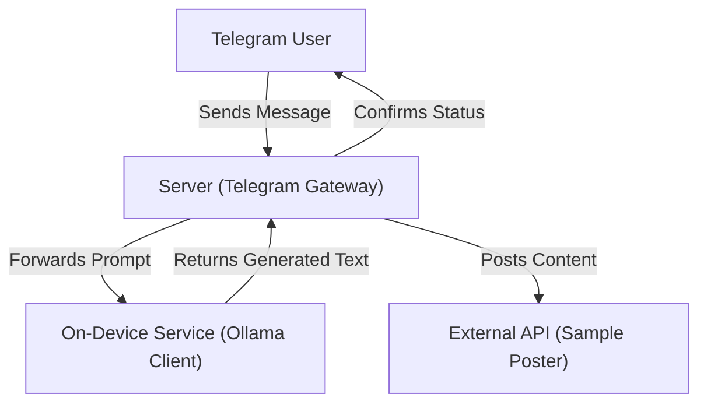

# Ultron Workspace Documentation

Welcome to the **Ultron** workspace. This repository contains the core components of the Ultron project, a system designed to bridge Telegram communications with an on-device Large Language Model (LLM) and post results to an external API.

## Architecture Overview

The system follows a gateway-controller-service pattern:

---

## Component Breakdown

### 1. [Server](file:///e:/ultron/server)

The central orchestrator of the system.

- **Role**: Acts as a gateway between Telegram and the LLM service.
- **Key Functionality**:
  - **Webhook handling**: Receives messages from Telegram.
  - **Coordination**: Forwards prompts to the laptop and sends results to the external API.
  - **Communication**: Sends status updates back to the user via Telegram.

### 2. [On-Device Service](file:///e:/ultron/ondevice)

The local LLM processing unit.

- **Role**: Provides low-latency, private text generation.
- **Key Functionality**:
  - **FastAPI Interface**: Exposes a `/generate` endpoint.
  - **Ollama Integration**: Connects to the local Ollama instance to generate responses.
  - **Security**: Implements SHARED_SECRET authentication.

### 3. [External API](file:///e:/ultron/external)

A mock/sample API for testing integrations.

- **Role**: Simulates a third-party platform where content is published.
- **Key Functionality**:
  - **Node.js/Express**: A simple server with a `/post` endpoint.
  - **Verification**: Validates Bearer tokens and logs received payloads.

---

## Major Files Description

| Directory   | File                                                            | Description                                         |
| :---------- | :-------------------------------------------------------------- | :-------------------------------------------------- |
| `server/`   | [main.py](file:///e:/ultron/server/main.py)                     | Main FastAPI entry point for the Telegram gateway.  |
| `server/`   | [laptop_client.py](file:///e:/ultron/server/laptop_client.py)   | Client for interacting with the `ondevice` service. |
| `server/`   | [poster.py](file:///e:/ultron/server/poster.py)                 | Logic for posting content to the external API.      |
| `ondevice/` | [app.py](file:///e:/ultron/ondevice/app.py)                     | Main FastAPI application for the on-device LLM.     |
| `ondevice/` | [ollama_client.py](file:///e:/ultron/ondevice/ollama_client.py) | Functions to call the Ollama API locally.           |
| `external/` | [index.js](file:///e:/ultron/external/index.js)                 | Sample Express server for testing the posting flow. |

---

## Execution Status

Currently, the following services are active in the workspace:

- **On-Device Service**: Running on port `8000` (with ngrok tunnel).
- **Server Gateway**: Running on port `8001`.
- **Sample External API**: Configured to receive posts from the gateway.
